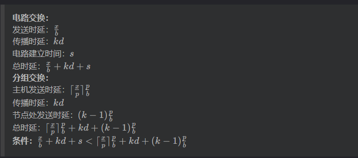
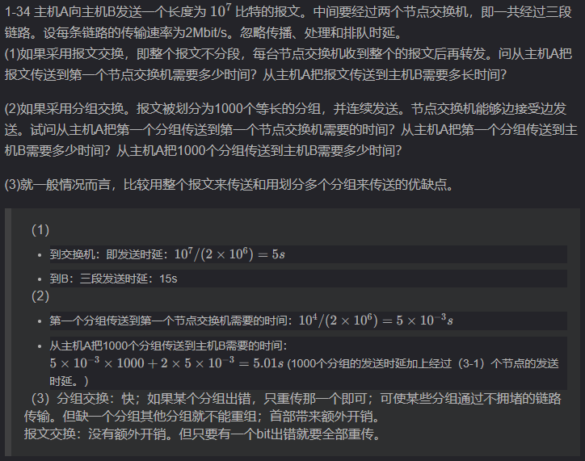
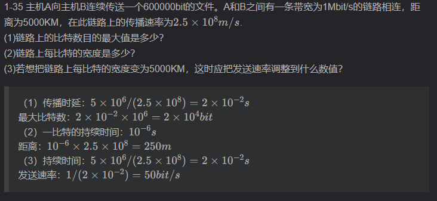

### 1-10 试在下列条件下比较电路交换和分组交换。要传送的报文共 x（bit）。从源点到终点共经过 k 段链路，每段链路的传播时延为 d（s），数据率为 b(b/s)。在电路交换时电路的建立时间为 s(s)。在分组交换时分组长度为 p(bit)，且各结点的排队等待时间可忽略不计。问在怎样的条件下，分组交换的时延比电路交换的要小？（提示：画一下草图观察 k 段链路共有几个结点。）
  

### 1-11 在第10题的分组交换网中，设报文长度和分组长度分别为x和(p+h)(bit)，其中p为分组的数据部分的长度，h为每个分组所添加的首部长度，与p的大小无关。通信的两端共经过k段链路。链路的数据率为b(bit/s)，但传播时延和节点的排队时间均可忽略不计。若打算使总的时延为最小，问分组的数据部分长度p应取为多大？
  

### 1-19 长度为100字节的应用层数据交给传输层传送，需加上20字节的TCP首部。再交给网络层传送，需加上20字节的IP首部。最后交给数据链路层的以太网传送，加上首部和尾部工18字节。试求数据的传输效率。数据的传输效率是指发送的应用层数据除以所发送的总数据（即应用数据加上各种首部和尾部的额外开销）。若应用层数据长度为1000字节，数据的传输效率是多少？

100/（100+20+20+18）=63.3%  
1000/（1000+20+20+18）=94.5%    

### 1-34
  

### 1-35 
  

