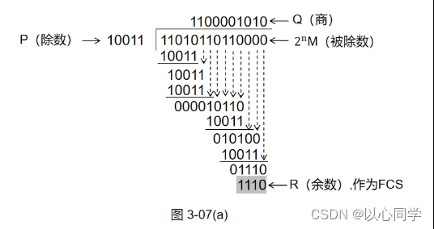
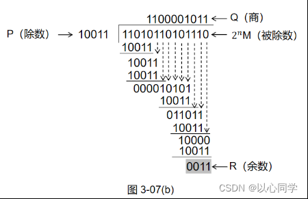
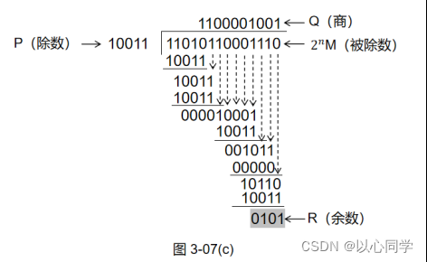
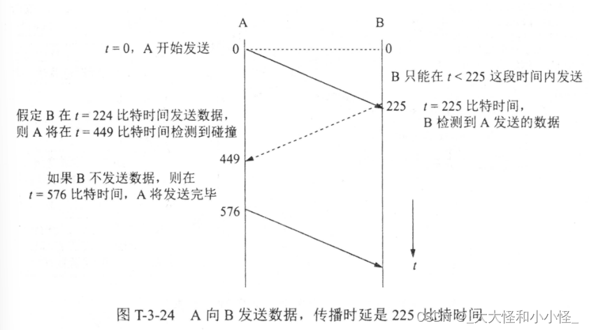
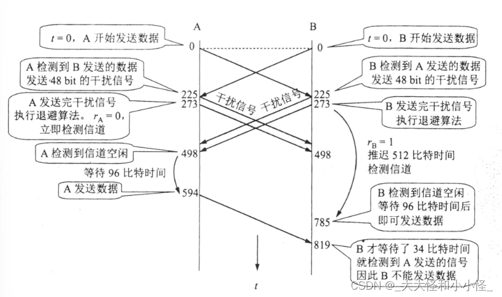
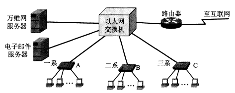
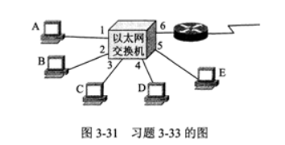
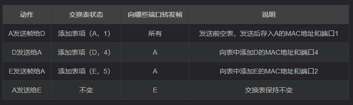

### 6 PPP协议的主要特点是什么？为什么PPP不使用帧编号？PPP适用于什么情况？为什么PPP协议不能使数据链路层实现可靠传输？  
答:（1）PPP协议具有以下特点：   
①简单：接收方每收到一个帧，就进行CRC检验。如CRC检验正确，就收下这个帧；反之，就丢弃这个帧，其他什么也不做。 
②封装成帧：PPP协议规定了特殊的字符作为帧定界符，以便使接收端能从收到的比特流中准确地找出帧的开始和结束位置。    
③透明性：PPP协议能够保证数据传输的透明性。如果数据中碰巧出现了和帧定界符一样的比特组合，PPP规定了一些措施来解决这个问题     
④支持多种网络层协议：PPP协议支持多种网络层协议（如IP和IPX等）在同一条物理链路上的运行。当点对点链路所连接的是局域网或路由器时，PPP协议必须同时支持在链路所连接的局域网或路由器上运行的各种网络层协议。  
⑤支持多种类型链路：PPP能够在多种类型的链路上运行。例如，串行的（一次只发送一个比特）或并行的（一次并行地发送多个比特），同步的或异步的，低速的或高速的，电的或光的，交换的（动态的）或非交换的（静态的）点对点链路。    

（2）PPP不使用帧的编号，因为帧的编号是为了出错时可以有效地重传，而PPP并不需要实现可靠传输。 

（3）PPP适用于线路质量不太差的情况。如果通信线路质量太差，传输就会频频出错。    

（4）PPP没有编号和确认机制，必须靠上层的协议（有编号和重传机制）才能保证数据传输正确无误。  

### 7 要发送的数据为1101011011。采用CRC的生成多项式是P(X)=X4+X+1。试求应添加在数据后面的余数。若要发送的数据在传输过程中最后一个变成了0，即变成1101011010，问接收端能否发现？若要发送的数据在传输过程中最后两个1都变成了0，即变成了1101011010，问接收端能否发现？采用CRC检验后，数据链路层的传输是否就变成了可靠的传输？       

答：①、因为生成多项式是P(X)=X4+X+1，所以除数P=10011。多项式是5位，则阶为4，所以在要发送的数据后面添加4个0得到被除数11010110110000。如图所示，计算余数。 
  
②、将检测序列加到1101011010后面，然后进行CRC检验，如图。    
  
③、将检测序列加到1101011000后面，然后进行CRC检验，如图。    
    
④、采用CRC检验后，数据链路层的传输并非变成了可靠的传输。当接收方发现错误时，就简单的丢弃这个帧。数据链路层并不能保证接收方接收到的和发送的完全一样。    

### 8 要发送的数据为101110。采用CRC生成多项式是P ( X ) = X 3 + 1试求应添加在数据后面的余数。     
011 

### 9 一个PPP帧的数据部分(用十六进制写出)是7D 5E FE 27 7D 5D 7D 5D 65 7D 5E。试问真正的数据是什么(用十六进制写出)？     
答：由字节填充法可知，7D 5E应当还原为7E，7D 5D应当还原为7D，故真正的数据部分应是：7E FE 27 7D 7D 65 7E。    

### 10 PPP协议使用同步传输技术传送比特串0110111111111100。试问经过零比特填充后变成怎样的比特串？若接收端收到的PPP帧数据部分是 0001110111110111110110，试问删除发送端加入的零比特后会变成怎样的比特串？
答：①经过零比特填充后：011011111011111000；
②删除发送端加入的零比特后：00011101111111111110。

### 20 假定1km长的CSMA/CD网络的数据率为1Gb/s。设信号在网络上的传播速率为200000km/s。求能够使用此协议的最短帧长。    

CSMA/CD的功能之一是冲突检测,其耗时最长为端到端传播时延的两倍。      
对于1km电缆，单程传播时间为1km/200000km=5为微秒，来回路程传播时间为10微秒，为了能够按照CSMA/CD工作，最小帧的发射时间不能小于10微秒，以Gb/s速率工作，10微秒可以发送的比特数等于10000,因此，最短帧是10000位或1250字节长       

### 22 假定在使用CSMA/CD协议的10Mb/s以太网中某个站在发送数据时检测到碰撞，执行退避算法时选择了随机数r=100。试问这个站需要等待多长时间后才能再次发送数据？如果是100Mb/s的以太网呢？

10Mb/s下，争用期：51.2 μ s 51.2\mu s51.2μs，要等待：100 × 51.2 μ s = 5.12 m s 100\times51.2\mu s =5.12ms100×51.2μs=5.12ms       
100Mb/s下，争用期：5.12 μ s 5.12\mu s5.12μs，要等待：0.512 m s 0.512ms0.512ms       

### 24 假定站点A和站点B在同一个10Mbit/s以太网网段上。这两个站点之间的传播时延为225比特时间，现假定A开始发送一帧，并且在A发送结束之前也发送一帧。如果A发送的是以太网所允许的最短帧，那么A在检测到和B发送碰撞之前能否把自己的数据发送完？
  
设t=0时开始发送，A发送的最短帧长时64字节=512比特。实际上在信道上传送的还有8字节(64bit)的前同步码和帧开始定界符。因此t=512+64=576bit时间。A应当发送完毕后，经过传播时间后，即t=225比特时间，B检测到A的信号，如图所示：   

因此，在t=225比特时间后以后B就不会发送数据了。反之，如果B在t=224比特时间或者之前发送数据就一定会和A发送的数据发生碰撞。B在t=224比特时间发送的第一个比特将在t=224+256=449比特时间到达A，因此A在检测到和B发送的数据发生碰撞之前显然还没有发送完毕，(449<576)。当A再发送完毕之前(t=576比特时间)没有检测到发生碰撞就表明A所发送的只能不会和B发送的帧发生碰撞。  

### 25 在上题中的站点A和站点B在t=0时同时发送了数据帧。当t=225比特时间,A和B同时检测到发生了碰撞。并且在t=225+48比特时间完成了干扰信号的传输。A和B在CSMA/CD算法中选择了不同的r值退避，假定A和B选择的随机数分贝是rA=0和rB=1，试问A和B各在什么时间开始重传数据帧？A重传的数据帧在什么时间到达B？A重传的数据会不会和B重传的数据再次发生碰撞？B会不会在预定的重传时间停止发生数据？   
   
t=0时刻，A和B开始发送数据。     
t=225比特时间，A和B都检测到碰撞。       
t=273比特时间，A和B结束干扰信号的传输。A和B马上执行执行退避算法。       
因为rA=0,rB=1,所以A立即检测到信道，而B要推迟512比特时间才可以检测信道。     
也就是说，A在t=273比特时间就开始检测信道，但B要等到t=785比特时间才检测信道。    

当t=273+225=498比特时间，B的感染信号中的最后一个比特到达A：A检测到信道空闲，但A还不能马上发生数据，必须等待96比特时间才能发生数据(以太网的最小间隔就是96比特时间)。这样，当t=498+96=594bit时间，A开始发送数据。

再看一下B什么时候可以发送数据。当t=273+512=785比特时间(B从273比特时间算起，经过1个争用期512比特时间)，再次检测信道，若空闲，则B在96bit事件后，即t=785+96=881比特时间发送数据。请注意，只有在785-881bit时间B一直检测到信道是空闲的,B才在881比特时间发送数据。

当t=594+225=819bit时间，A在594bit时间发送的数据到达B。可见从785bit时间算起，才经过了34bit时间，B就检测到信道繁忙。因此B的881比特时间不发送数据。

### 30 在图3-30 中，某学院的以太网交换机有三个接口分别和学院三个系的以太网相连，另外三个接口分别和电子邮件服务器、万维网服务器以及一个连接互联网的路由器相连。图中的A,B和C都是100Mbit/s以太网交换机。假定所有的链路的速率都是100Mbit/s，并且图中的9台主机中的任何一个都可以和任何–个服务器或主机通信。试计算这9台主机和两个服务器产生的总的吞吐量的最大值。为什么?

  

交换机具有并行性，联通一台交换机上的端口，多对主机同时工作，所以9台主机的吞吐量为900Mbit/s，两台服务器为200Mbit/s，所以共为1100Mbit/s。

### 31 假定在图3-30中的所有链路的速率仍然为100 Mbit/s，但三个系的以太网交换机都换成为100Mbit/s的集线器。试计算这9台主机和两个服务器产生的总的吞吐量的最大值。为什么?    
集线器不能并行工作，三台集线器最大吞吐量300Mbit/s，两台服务器200Mbit/s，共500Mbit/s。

### 33 在图3-31中，以太网交换机有6个端口，分别接到5台主机和一个路由器。

  

下面表中动作一栏中，表示先后发送了4个帧。假定在开始时，以太网交换机的交换表是空的。把表中的项目填完。   
  
