### 10.当某个路由器发现一IP数据报的检验和有差错时，为什么采取丢弃的办法而不是要求源站重传此数据报？计算首部检验和为什么不采用CRC检验码？    
答：纠错控制由上层（传输层）执行 IP首部中的源站地址也可能出错请错误的源地址重传数据报是没有意义的 不采用CRC简化解码计算量，提高路由器的吞吐量
### 13.什么是最大传送单元MTU？它和IP数据报的首部中的哪个字段有关系？     
答：IP层下面数据链里层所限定的帧格式中数据字段的最大长度，与IP数据报首部中的总长度字段有关系。

### 16.（1）试解释为什么ARP高速缓存每存入一个项目就要设置10~20分钟的超时计时器。这个时间设置的太大或太小会出现什么问题？    
答：考虑到IP地址和MAC地址的映射可能发生变化（更换网卡，或动态主机配置）。10－20分钟更换一块网卡是合理的。超时时间太短会使ARP请求和响应分组的通信量太频繁，而超时时间太长会使更换网卡后的主机迟迟无法和网络上的其他主机通信。    
### （2）至少举出两种不需要发送ARP请求分组的情况（即不需要请求将某个目的IP地址解析为相应的MAC地址）。   
答：在源主机的ARP高速缓存中已经有了该目的IP地址的项目；源主机发送的是广播分组；源主机和目的主机使用点对点链路。 

### 17.主机A发送IP数据报给主机B，途中经过了5个路由器。试问在IP数据报的发送过程中总共使用了几次ARP？     
答：6次，主机用一次，每个路由器各使用一次。

### 18.设某路由器建立了如下路由表：     
目的网络-------------------下一跳   
192.4.153.0/26--------------R3  
128.96.39.0/25-------------接口m0   
128.96.39.128/25---------接口m1     
128.96.40.0/25-------------R2   
192.4.153.0/26-------------R3   
（默认）--------------------R4      
现共收到5个分组，其目的地址分别为：     
（1）128.96.39.10   
（2）128.96.40.12   
（3）128.96.40.151      
（4）192.4.153.17   
（5）192.4.153.90   

(1)分组的目的地址为：128.96.39.10先与子网掩码255.255.255.128相与得128.96.39.0，由路由表对照，则下一跳接口为m0。     
(2)分组的目的地址为：128.96.40.12先与子网掩码255.255.255.128相与得128.96.40.0，由路由表对照，则下一跳接口为R2。     
(3)分组的目的地址为：128.96.40.151先与子网掩码255.255.255.128相与得
128.96.40.128，由路由表对照，则下一跳接口R4。       
(4)分组的目的地址为：192.4.153.17先与子网掩码255.255.255.192相与得192.4.153.0，由路由表对照，则下一跳接口R3。       
(5)分组的目的地址为：192.4.153.90与子网掩码255.255.255.192相与得192.4.153.64，经查路由表知，该分组转发选择默认路由，则下一跳接口为R4。      

### 20.一个数据报长度为4000字节（固定首部长度）。现在经过一个网络传送，但此网络能够传送的最大数据长度为1500字节。试问应当划分为几个短些的数据报片？各数据报片的数据字段长度、片偏移字段和MF标志应为何数值？     
解：这里需要注意到一个问题就是 IP数据报固定首部长度为20字节。解释MF标志字段中的最低位为MF（More Fragment）。MF=1即表示后面还有分片的数据报。MF=0表示这已是若干数据报片中最后一个。片偏移量为8个字节为一个单位。     
首先是4000个字节，而网络能够传送的最大数据长度为1500字节，所以最少需要分成3段。     
总长度----------数据字段长度----------MF----------片偏移字段    
1500----------------1480-------------------1-------------0/8=0  
1500----------------1480-------------------1-------------1480/8=185   
1040----------------1020-------------------0-------------(1480+1480)/8=370      

26.
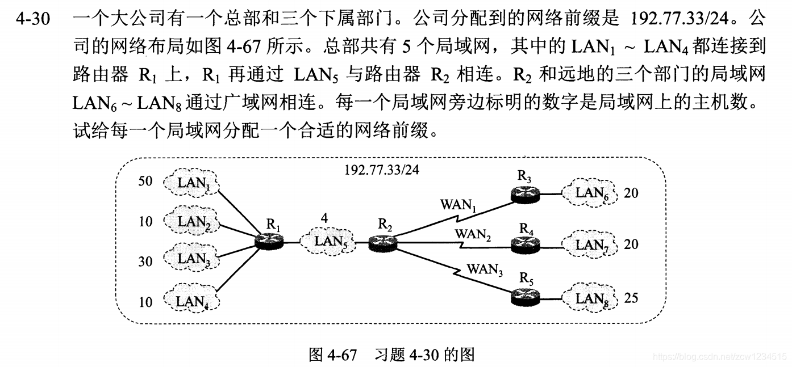  
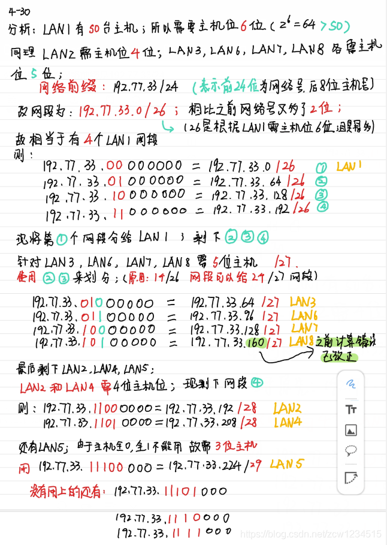 

### 31.已知地址块中的一个地址是140.120.84.24/20。试求这个地址块中的最小地址和最大地址。地址掩码是什么？地址块中共有多少个地址？相当于多少个C类地址？
答：因为CIDR没有A类、B类、C类的地址划分概念，IP地址由网络前缀的主机号组成，/20表示网络前缀有20位，剩下的就是主机号。    
140.120.84.24/20转换为二进制是：10001100.01111000.01010100.00000000。黑体部分为网络前缀，所以只有主机号可以变。     
最小地址为：140.120.80.0/20     
最大地址为：140.120.95.255/20   
地址掩码为：11111111.11111111.11110000.00000000(这里就是网络位变为1，主机位为0)     
共有$2^{12}$个地址。相当于16个C类地址。

### 36. RIP使用UDP，OSPF使用IP，而BGP使用TCP。这样做有何优点？为什么RIP周期性地和临站交换路由器由信息而BGP却不这样做？  
答：RIP只和邻站交换信息，使用UDP无可靠保障，但开销小，可以满足RIP要求；
OSPF使用可靠的洪泛法，直接使用IP，灵活、开销小；    
BGP需要交换整个路由表和更新信息，TCP提供可靠交付以减少带宽消耗；    
RIP使用不保证可靠交付的UDP，因此必须不断地（周期性地）和邻站交换信息才能使路由信息及时得到更新。但BGP使用保证可靠交付的TCP因此不需要这样做。   

### 37.假定网络中得路由器B的路由表有如下项目。

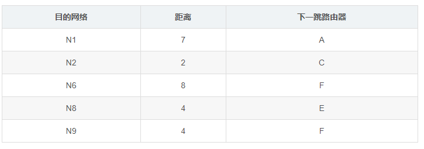  

现在B收到从C发来的路由信息如下表。  
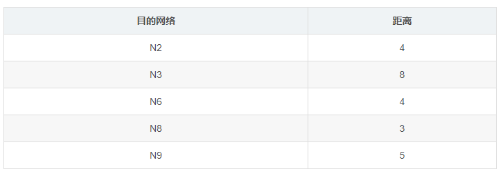  
试求出路由器B更新后的路由表详细说明每一个步骤   
答：先把B收到的路由信息中距离都加1，并且在后面添加C得新表： 
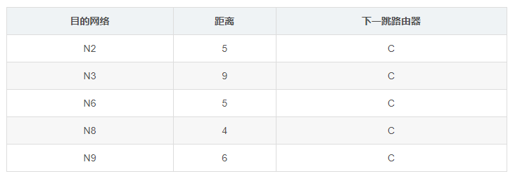  
然后进行对比新表和B表的”目的网络“和”距离“。         
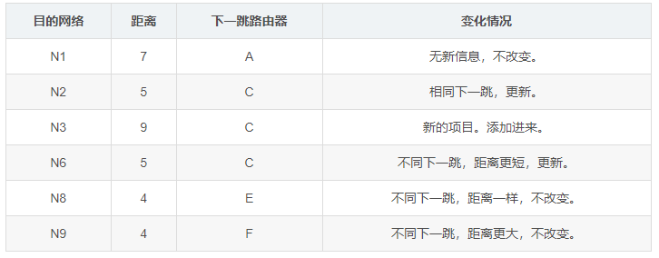    

### 49.收到一个分组，其目的地址D=11.1.2.5。要查找的转发表中有这样三项：
路由器1：到达网络11.0.0.0/8     
路由器2：到达网络11.1.0.0/16    
路由器3：到达网络11.1.2.0/24    
试问在转发这个分组时应当选择哪一个路由？    
答：这种情况下应该遵从前缀最长匹配准则，那么就是路由器3最符合前缀，应该选择路由器3进行分组转发。    

### 50.同上题。假定路由1的目的网络11.0.0.0/8中有一台主机H，其IP地址是11.1.2.3。当我们发送一个分组给主机H时，根据最长前缀匹配准则，上面的这个转发表却把这个分组转发到路由3的目的网络11.1.2.0/24。是最长前缀匹配准则有时会出错么？    
答：这里呢最长前缀匹配准则是没有出问题的，有问题的是主机H的IP地址。因为网络11.1.2.0/24它是网络11.0.0.0/8的一个子网，主机H的IP地址11.1.2.3属于11.1.2.0/24的一个IP地址。网络11.0.0.0/8在分配网络时，不允许重复使用子网掩码11.1.2.0/24中的网络地址。因此，网络11.0.0.0/8给他的一个主机分配IP地址11.1.2.3是绝不能允许的。所以只能是11.1.2.0/24分配给IP地址11.1.2.3，因此才有了题目中出现的混乱情况。

### 57.试把以下的IPv6地址用零压缩方法写成简洁形式:  
(1)0000:0000:F53:6382:AB00:67DB:BB27:7332   
(2)0000:0000:0000:0000:0000:0000:004D:ABCD      
(3)0000:0000:0000:AF36:7328:0000:87AA:0398      
(4)2819:00AF:0000:0000:0000:0035:0CB2:B271  
答：    
(1) ::F53:6382:AB00:67DB:BB27:7332  
(2)::4D:ABCD        
(3)::AF36:7328:0:87AA:398   
(4)2819:AF::35:CB2:B271     

### 58.试把以下零压缩的IPv6地址写成原来的形式:      
(1)0::0     
(2)0:AA::0      
(3)0: 1234 :3   
(4)123::1:2     
答：(1)0000:0000:0000:0000:0000:0000:0000:0000  
(2)0000:00AA:0000:0000:0000:0000:0000:0000  
(3)0000: 1234 :0000:0000:0000:0000:0000:0003    
(4)0123:0000:0000:0000:0000:0000:0001:0002  

### 59.从IPv4过渡到IPv6的方法有哪些？
答：1.双协议栈：双协议栈是指在完全过渡到IPv6之前，使一部分主机同时装有IPv4和IPv6这两种协议栈。  
2.隧道技术：在IPv6数据报要进入IPv4网络时，把IPv6数据报封装成为IPv4数据报。

### 66.如图是一个SDN OpenFlow网络。假定：
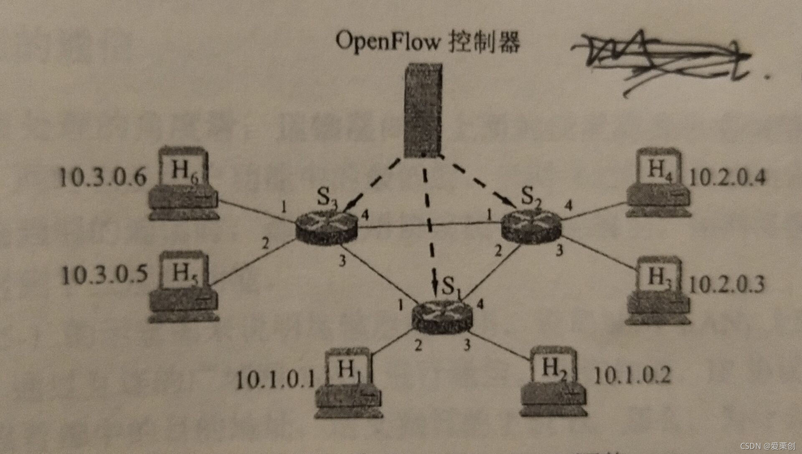  
(1)任何来自H5或者H6并到达输入端口1的且发往H1或者H2的分组，应通过端口2转发出去。     
(2)任何来自H1或者H2并到达输入端口2的且发往H5或者H6的分组，应通过端口1转发出去。     
(3)任何从端口1或者2进入的且发往H3或者H4的分组，应交付指明的主机。   
(4)H3或者H4彼此可以互相发送分组。   
试给出交换机S2的流表项(每一行的“匹配+动作“)。   

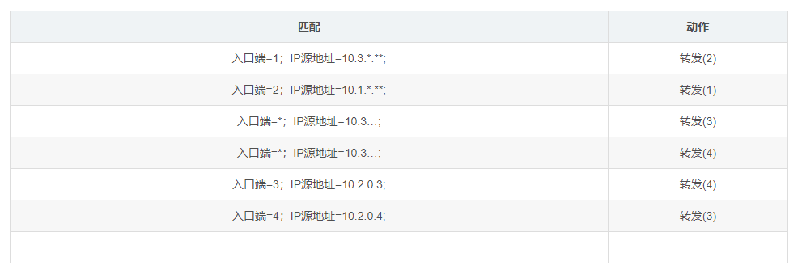  

### 补充1 某网络拓扑如下页图所示，路由器R1通过接口E1、E2分别连接局域网1、局域网2，通过接口L0连接路由器R2，并通过路由器R2连接域名服务器与互联网。R1的L0接口的IP地址是202.118.2.1;R2的L0接口的IP地址是202.118.2.2，L1接口的IP地址是130.11.120.1，E0接口的IP地址是202.118.3.1;域名服务器的IP地址是202.118.3.2。    
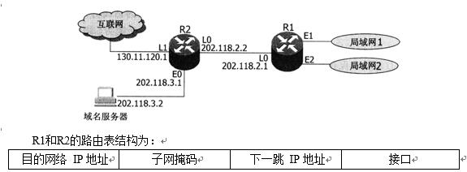  
　(1) 将IP地址空间202.118.1.0/24划分为2个子网，分别分配给局域网1、局域网2，每个局域网需分配的IP地址数不少于120个。请给出子网划分结果，说明理由或给出必要的计算过程。    

　　(2) 请给出R1的路由表，使其明确包括到局域网1的路由、局域网2的路由、域名服务器的主机路由和互联网的路由。      

　　(3) 请采用路由聚合技术，给出R2到局域网1和局域网2的路由。    

　　(1) 把IP地址空间202.118.1.0/24划分为2个等长的子网。划分结果为：子网1：子网地址为202.118.1.0，子网掩码为255.255.255.128(或子网1：202.118.1.0/25)     

　　子网2：子网地址为202.118.1.128，子网掩码为255.255.255.128(或子网2：202.118.1.128/25)        

　　地址分配方案：子网1分配给局域网1，子网2分配给局域网2;或子网1分配给局域网2， 子网2分配给局域网1。        

　　R1的路由表如下：        
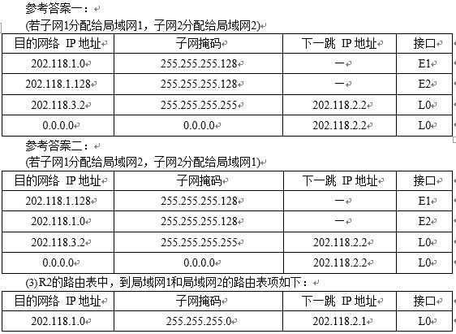  

### 补充2 假设Internet的两个自治系统构成的网络如题47图所示，自治系统AS1由路由器R1连接两个子网构成;自治系统AS2由路由器R2、R3互联并连接3个子网构成。各子网地址、R2的接口名、R1与R3的部分接口IP地址如题47图所示。      
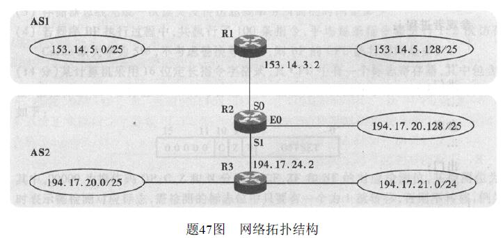  
　请回答下列问题。  

　　(1)假设路由表结构如下表所示。请利用路由聚合技术，给出R2的路由表，要求包括到达题47图中所有子网的路由，且路由表中的路由项尽可能少。   
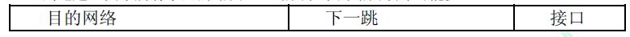  
　　(1)(6分)在AS1中，子网153.14.5.0/25和子网153.14.5.128/25可以聚合为子网153.14.5.0/24;在AS2中，子网194.17.20.0/25和子网194.17.21.0/24可以聚合为子网194.17.20.0/23，但缺少194.17.20.128/25;子网194.17.20.128/25单独连接到R2的接口E0。   
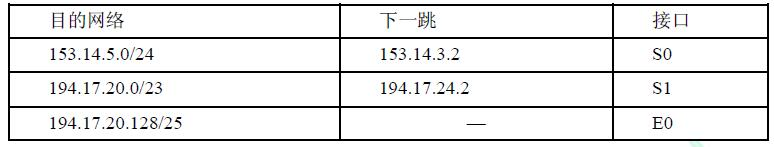  
(2)该IP分组的目的Ip地址194.17.20.200与路由表中194.17.20.0/23和194.17.20.128/25两个路由表项均匹配，根据最长匹配原则，R2将通过E0接口转发该IP分组。(1分)   

　　(3)R1与R2之间利用BGP4(或BGP)交换路由信息;(1分)BGP4的报文被封装到TCP协议段中进行传输。(1分)      

### 某校园网有两个局域网，通过路由器R1、R2和R3互联后接入 Internet，S1和S2为以太网交换机。局域网采用静态IP地址配置，路由器部分接口以及各主机的IP地址如下图所示。     
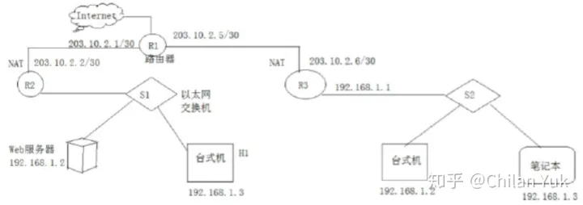  

假设NAT转换表结构为：   
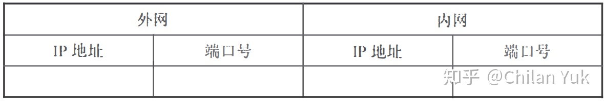  

请回答下列问题：

（1）为使H2和H3能够访问Web服务器（使用默认端口号），需要进行什么配置？  

（2）若H2主动访问Web服务器时，将HTTP请求报文封装到IP数据报P中发送，则H2发送P的源IP地址和目的IP地址分别是什么？经过R3转发后，P的源IP地址和目的IP地址分别是什么？经过R2转发后，P的源IP地址和目的IP地址分别是什么？    

答：

（1）Web服务器、H1和H2、H3这两个子网使用了相同网段（192.168.1.*），且路由器开启了NAT功能，加上题干给出了NAT表的结构，因此需要配置NAT表。    
路由器R2开启NAT服务，当路由器R2从WAN口收到H2或H3发来的数据时，根据NAT表发送给Web服务器的对应端口。外网IP地址应该为路由器的外端IP地址，内网IP地址应该为Web服务器的地址，Web服务器的默认端口为80，因此内网端口号固定为80，当其他网络的主机访问Web服务器时，默认访问的端口应该也是80，但是访问的目的IP是路由器的IP地址，因此NAT表中的外部端口最好也统一为80。题目中并未要求对H1进行访问,因此H1的NAT表项可以不写。R2的NAT表配置如下：   

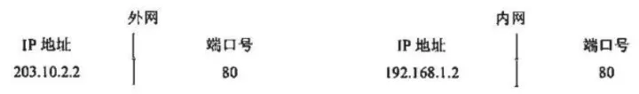  
（2）由于启用了NAT服务，H2发送的数据报P的源IP地址应该是H2的内网地址，目的地址应该是R2的外网IP地址，源IP地址是192.168.1.2，目的IP地址是203.10.2.2。

R3转发后，将数据报P的源IP地址改为R3的外网IP地址，目的IP地址仍然不变，源IP地址是203.10.2.6，目的IP地址是203.10.2.2。

R2转发后，将数据报P的目的IP地址改为Web服务器的内网地址，源地址仍然不变，源IP地址是203.10.2.6，目的IP地址是192.168.1.2。