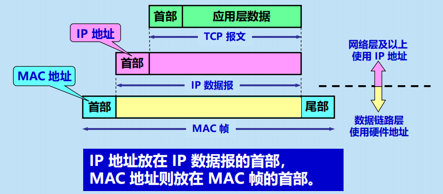

# 4 网络层
网络层尽最大努力交付。  
划分为数据层面和控制层面。  
## 网际协议IP
+ 物理层中间设备转发器
+ 数据链路层网桥、桥接器、交换机
+ 网络层路由器
+ 网路层之上网关
### IP地址
32位    
A类 0 B 10 C 110 D 1110     
网络号全0，本网络   
网络号全1.环回测试  
如果主机号全0，IP地址代表仅网络号指向的那个网段，该IP代表一个网段；     
如果主机号全1，IP地址代表网络号指向的全部主机，IP地址代表广播地址    
### IP地址与MAC地址

### 地址解析协议ARP
### IP数据报的格式
136     
+ 标志 MF=1 还有分片
+ 片偏移 以8个字节为单位

### 最长前缀匹配
## 网际控制报文协议ICMP
ICMP差错报文和ICMP询问报文  

## IPv6
128位   
### 从IPv4向IPv6过渡
+ 双协议栈
+ 隧道技术
## 路由选择协议
局域网LAN   广域网WAN
### 内部网关协议RIP
160
坏消息传播得慢
### 内部网关协议OSPF
洪泛法发送与本路由器相邻的所有路由器的链路状态。    
Dijkstra算法
### 外部网关协议BGP
边界路由通信须建立TCP连接

X，AS1，R1 从R1经过AS1可到达X

BGP并非仅运行在AS之间，而且也要运行在AS内部。AS内部建立iBGP

BGP路由选择
+ 本地偏好
+ 热土豆（使分组尽快离开AS，而不考虑从哪个路由器离开）

## 虚拟专用网VPN和网络地址转换NAT

## 软件定义网络SDN简介
要点是把网络的控制层面和数据层面分离，而让控制层面利用阮籍来控制数据层面的许多设备。    
SDN取代传统转发表的是“流表”。流表：匹配+动作。  
通信层与数据层面的接口叫作南向API接口。     
到网络控制应用程序层的接口，北向API接口。

